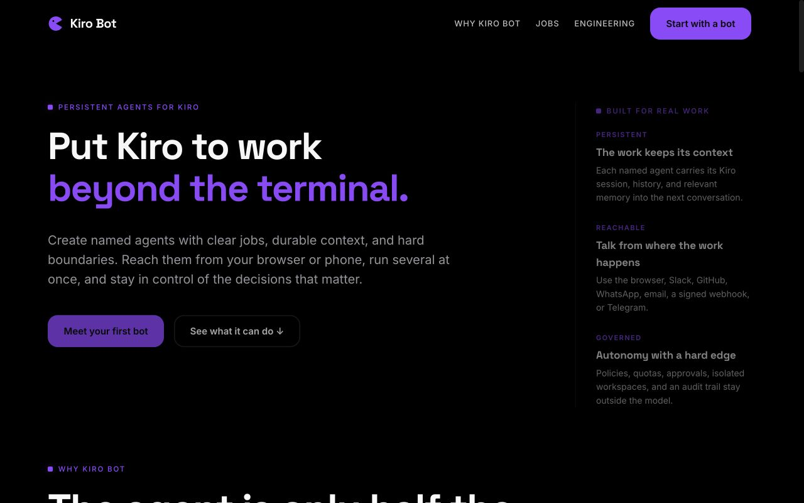

# Kiro Bot


**Put Kiro to work beyond the terminal.**

Kiro Bot is the local control plane for persistent Kiro agents, recurring work,
and governed coding handoffs. Create named agents with clear jobs, reach them
from your browser or phone, run several at once, and keep consequential actions
behind deterministic boundaries.



Kiro remains the agentic engine that reasons, writes code, and uses tools. Kiro
Bot launches `kiro-cli acp` and owns the durable product layer around it:
identity, conversations, memory, queues, channels, schedules, approvals,
workspaces, and orchestration.

See [docs/positioning.md](docs/positioning.md) for the product promise, proof
points, voice, and honest boundaries.

## What works now

- Start and initialize a local Kiro ACP runtime.
- Create or resume a Kiro session.
- Stream text, thinking, tool, usage, and raw ACP events.
- Ask the human before approving tool calls.
- Cancel an active turn.
- Persist named bots, Kiro session IDs, turns, and events in SQLite.
- Continue the same named bot across separate CLI invocations.
- Keep one long-running worker per bot with FIFO turns.
- Run different bots concurrently.
- Stream runs over WebSocket with reconnect-safe sequence cursors.
- Approve once, reject, or cancel from the browser. Persistent grants are
  governed centrally through the Safety policy instead of Kiro-side bypasses.
- Persist each pending human gate independently of the live stream. Reload the
  control room and the exact action is still actionable; there is no blanket
  "trust this run" shortcut.
- Browse durable conversation history and live tool activity.
- Preserve completed exchanges in an append-only shared-memory ledger, retrieve
  a bounded relevance-and-recency evidence bundle across local chat and remote
  channels, and inspect the exact cross-surface records in the Memory panel.
- Use a responsive local control room on desktop or mobile widths.
- Schedule durable one-time or repeating routines with lease-safe dispatch.
- Configure deterministic tool approval policies and hourly, daily, or
  concurrent run quotas per bot.
- Review an immutable, payload-free audit trail of submissions, outcomes, and
  permission decisions.
- Register stdio or HTTPS MCP servers and bind their capabilities per bot.
- Resolve MCP secrets from environment-variable references only at launch;
  plaintext secret values are never persisted by the registry.
- Treat the governed plugin registry as the only MCP configuration source,
  refresh changed bindings before the next turn, and redact launch secrets
  even from optional ACP trace output.
- Recover queued or interrupted work after a daemon restart with explicit
  at-least-once semantics and expiring execution leases.
- Coordinate durable multi-bot task graphs with bounded fan-out, dependency
  ordering, cancellation, and deterministic result aggregation.
- Create, start, inspect and cancel those plans conversationally through the
  built-in governed control MCP, or draw them as a drag-and-drop workflow board.
  A named bot can also call a different durable bot for one focused result.
- Create detached per-run Git worktrees, retain material output, and record
  bounded SHA-256 artifact manifests without force-cleaning user work.
- Run a durable, idempotent coding lifecycle in an isolated worktree: Kiro
  builds, deterministic checks verify, bounded Kiro repair turns correct
  failures, and a different bot independently reviews the result.
- Detect reviewer mutations, preserve the source checkout, retain the reviewed
  artifact manifest, and stop at an explicit human handoff. This layer never
  pushes, opens a pull request, merges, or publishes on its own.
- Invoke any named bot from authenticated Slack events, GitHub issues and
  comments, Telegram private chats (laptop long-poll, no public URL), WhatsApp
  Cloud API messages, normalized email webhooks, or a generic signed webhook.
- Deduplicate provider retries, preserve bounded source-thread context, filter
  allowed sources/senders, isolate external ACP sessions so unrelated source
  threads cannot inherit one another, recover accepted events after restart,
  and deliver optional replies to Slack threads or GitHub issue conversations.
- Return Telegram-originated tool gates as inline **Allow once** and **Deny**
  buttons; every decision is tied to the originating run and channel identity.

## Quick start

```bash
cd /Users/arin.mallanna/personal/kiro-bot
uv sync --extra server --extra dev
uv run kiro-bot bot create builder --cwd /Users/arin.mallanna/personal
uv run kiro-bot chat builder
```

For a one-shot task:

```bash
uv run kiro-bot ask builder "Inspect this repository and summarize it."
```

For the browser control room:

```bash
npm --prefix web-ui install
npm --prefix web-ui run build
uv run kiro-bot serve
```

Then open `http://127.0.0.1:8765/`. The server binds to loopback by default;
do not expose it to a network until authentication and origin controls are
enabled. The repository includes a dependency-free fallback control room under
`web/`; building `web-ui/` adds the full React landing, engineering, and console
experience under `web/dist/`.

The **Coding** panel starts and monitors verified patch executions. Select the
builder bot, choose a separate reviewer, describe the task, and provide direct
argument-vector checks such as `tests: python, -m, pytest, -q`. A ready result
still requires a human handoff approval.

The **Teams** workflow builder turns draggable bot cards and explicit "wait
for" links into the same durable dependency graph used by the API. Bots can
also invoke the reserved `kiro-control` MCP to create that graph directly from
a conversation; the host still asks before executing the control tool.

The **Channels** panel connects a selected bot to another place without storing
secret values. Configure the signing secret or reply token in the daemon's
environment, enter only the environment-variable names in the UI, and copy the
generated webhook URL. Telegram is the exception: the laptop polls Telegram, so
you do not need a public webhook. See [docs/channels.md](docs/channels.md) for
provider setup and payload contracts.

The **Memory** panel shows completed exchanges that can cross surface
boundaries. Local ACP conversation history and each provider thread remain
their own sources of truth; shared records are labelled by source, treated as
untrusted historical evidence, and injected only within a bounded retrieval
budget. The original visible user message is never rewritten.

Run the complete test suite with:

```bash
uv run pytest -q
```

Data is stored under `~/.kiro-bot/` by default. Override it with
`KIRO_BOT_HOME=/some/path`.

## Architecture

```text
CLI / browser / routines / team plans
              |
 Scheduler + Delegator + Engine
     /               \
per-bot FIFO      WebSocket subscribers
workers                 |
     \                   /
        BotOrchestrator
        /             \
 SQLite state       ACP runtime
 bots, turns       kiro-cli acp
 routines, policy      |
 durable runs/DAGs ephemeral MCP config
 plugins, audit        |
 shared memory         |
 workspaces/artifacts  |
 events, resume        |
                 Kiro sessions
                 tools + models
```

See [docs/architecture.md](docs/architecture.md) for the protocol trace,
security boundaries, and remaining roadmap.

## Live verification

The normal suite is fully fake-backed and does not need a Kiro login. To prove
the complete schedule-to-model path against your signed-in local Kiro CLI, run:

```bash
uv run python scripts/live_scheduler_smoke.py
```

This creates an isolated temporary Kiro Bot database, fires one due routine,
waits for the real ACP turn, verifies its answer and audit records, and removes
the temporary database when finished.

To exercise the complete coding lifecycle against your signed-in Kiro CLI:

```bash
uv run python scripts/live_coding_smoke.py
```

The smoke test creates a temporary Git repository, lets Kiro edit only its
detached worktree, runs a deterministic check, sends the result to a different
reviewer bot, verifies the original checkout stayed unchanged, and approves
the final human handoff.

Only one controller may use a data directory at a time. If the daemon is
running, send work through its browser/API rather than starting a second CLI
controller against the same `KIRO_BOT_HOME`.

## Independence

This is a from-scratch implementation around Kiro's ACP interface. KiroCrew and
the unofficial reconstructed Grok Bot repository were used only to understand
publicly observable architectural patterns and failure modes. No source files
from either project are included here.
