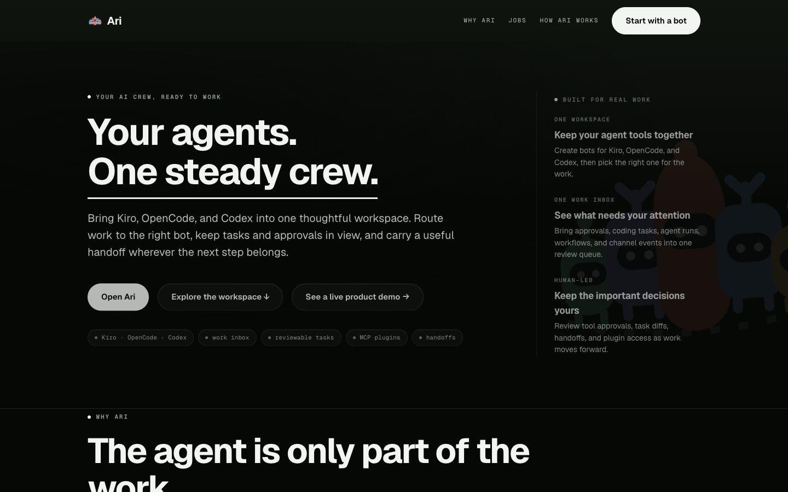

# Ari


**Your agents. One steady crew.**

Ari brings Kiro, OpenCode, and Codex into one workspace. Route work to the right
bot, keep tasks and approvals in view, and carry useful context between engines.
Each engine keeps its own account, model access, and native tool execution.



The selected engine reasons, writes code, and uses its native tools. Ari owns the
product layer around it: bot identity, conversations, memory, work queues,
channels, schedules, approvals, coding tasks, plugins, and orchestration. Ari
also supports cross-engine handoff with a bounded brief and repository context.

See [docs/positioning.md](docs/positioning.md) for the product promise, proof
points, voice, and honest boundaries.

**Live site:** [kyn-blush.vercel.app](https://kyn-blush.vercel.app) — marketing
landing and How Ari works page (always on). The full control room runs on your
machine with `ari serve`, or on Fly.io for long-running hosting ([docs/deploy.md](docs/deploy.md)).

## What works now

- Start Kiro, OpenCode, or Codex ACP engines, selected per bot.
- Create and continue bot conversations through the selected engine.
- Stream normalized text, tool activity, and usage events.
- Ask the human before approving tool calls.
- Cancel an active turn.
- Persist named bots, engine session identifiers, turns, and events in SQLite.
- Continue the same named bot across separate CLI invocations.
- Keep one long-running worker per bot with FIFO turns.
- Run different bots concurrently.
- Stream runs over WebSocket with reconnect-safe sequence cursors.
- Approve once, reject, or cancel from the browser. Persistent grants are
  governed centrally through the Safety policy instead of provider-side bypasses.
- Persist each pending human gate independently of the live stream. Reload the
  control room and the exact action is still actionable; there is no blanket
  "trust this run" shortcut.
- Browse durable conversation history and live tool activity.
- Preserve completed exchanges in an append-only shared-memory ledger, retrieve
  a bounded relevance-and-recency evidence bundle across local chat and remote
  channels, and inspect the exact cross-surface records in the Memory panel.
- Use a responsive local control room on desktop or mobile widths.
- Review pending approvals, bot runs, coding tasks, workflows, and channel events
  together in the Work inbox, with direct links to the relevant review surface.
- Schedule durable one-time or repeating routines with lease-safe dispatch.
- Configure deterministic tool approval policies and hourly, daily, or
  concurrent run quotas per bot.
- Review an immutable, payload-free audit trail of submissions, outcomes, and
  permission decisions.
- Register stdio or HTTPS MCP servers and bind their capabilities per bot.
- Resolve MCP secrets from environment-variable references only at launch;
  plaintext secret values are never persisted by the registry.
- Treat the governed plugin registry as the only MCP configuration source,
  refresh changed bindings before the next turn, and redact launch secrets
  even from optional ACP trace output.
- Recover queued or interrupted work after a daemon restart with explicit
  at-least-once semantics and expiring execution leases.
- Coordinate durable multi-bot task graphs with bounded fan-out, dependency
  ordering, cancellation, and deterministic result aggregation.
- Create, start, inspect and cancel those plans conversationally through the
  built-in governed control MCP, or compose them on a visual workflow canvas:
  drag bot nodes, connect their ports with arrows, zoom, and auto-layout the DAG.
  A named bot can also call a different durable bot for one focused result.
- Create detached per-run Git worktrees, retain material output, and record
  bounded SHA-256 artifact manifests without force-cleaning user work.
- Run reviewable coding tasks on isolated branches and worktrees, with checks,
  bounded repair, and an independent reviewer.
- Review task files and diffs, then approve before merging into the selected
  local base branch. Ari does not open pull requests or publish changes.
- Invoke any named bot from authenticated Slack events, GitHub issues and
  comments, Telegram private chats (laptop long-poll, no public URL), WhatsApp
  Cloud API messages, normalized email webhooks, or a generic signed webhook.
- Deduplicate provider retries, preserve bounded source-thread context, filter
  allowed sources/senders, isolate external ACP sessions so unrelated source
  threads cannot inherit one another, recover accepted events after restart,
  and deliver optional replies to Slack threads or GitHub issue conversations.
- Return Telegram-originated tool gates as inline **Allow once** and **Deny**
  buttons; every decision is tied to the originating run and channel identity.

## Quick start

```bash
cd /Users/arin.mallanna/personal/kiro-bot
uv sync --extra server --extra dev
uv run ari bot create builder --cwd /Users/arin.mallanna/personal --engine opencode
uv run ari chat builder
```

For a one-shot task:

```bash
uv run ari ask builder "Inspect this repository and summarize it."
```

For the browser control room:

```bash
npm --prefix web-ui install
npm --prefix web-ui run build
uv run ari serve
```

Then open `http://127.0.0.1:8765/`. The service binds to loopback by default.
Before remote access, configure `KYN_ACCESS_TOKEN`, allowed origins, and a
private or authenticated network path. To build the macOS app and DMG, see
[docs/desktop-app.md](docs/desktop-app.md).
The repository includes a dependency-free fallback control room under
`web/`; building `web-ui/` adds the full React landing, product guide, and console
experience under `web/dist/`.

### Product demo video (Remotion)

A 60-second ProductDemo composition lives under `web-ui/video/`. It reuses the
React console chrome (Sidebar, Thread, Live inspect, design tokens) with staged
state, cursor interactions, and camera moves.

```bash
npm --prefix web-ui install
npm --prefix web-ui run video          # Remotion Studio preview
npm --prefix web-ui run video:render   # writes web-ui/out/kyn-demo.mp4
```

The **Tasks** panel starts and monitors reviewable coding tasks. Select a builder
and a different reviewer, describe the task, choose a base branch, and provide
direct argument-vector checks such as `tests: python, -m, pytest, -q`. Inspect
changed files, checks, reviewer findings, and the diff. Approve the handoff
before merging the reviewed task into its local base branch.

The **Workflow playground** is a dedicated control-room surface for composing
and reviewing a team. It keeps every saved workflow in a left rail, renders
its graph on a full canvas, shows recorded per-bot output in the bottom event
panel, and validates bad arrows before a plan is sent. Pinch (or ⌘/Ctrl +
wheel) zooms the canvas; node ports create explicit dependencies. Bots can
also invoke the reserved control MCP to create that graph directly from
a conversation; the host still asks before executing the control tool.

The **Channels** panel connects a selected bot to another place without storing
secret values. Configure the signing secret or reply token in the daemon's
environment, enter only the environment-variable names in the UI, and copy the
generated webhook URL. Telegram is the exception: the Ari service polls Telegram, so
you do not need a public webhook. See [docs/channels.md](docs/channels.md) for
provider setup and payload contracts.

The **Memory** panel shows completed exchanges that can cross surface
boundaries. Local ACP conversation history and each provider thread remain
their own sources of truth; shared records are labelled by source, treated as
untrusted historical evidence, and injected only within a bounded retrieval
budget. The original visible user message is never rewritten.

Run the complete test suite with:

```bash
uv run pytest -q
```

New installs store data under `~/.ari/`. Ari reuses an existing `~/.kyn/`
folder automatically and keeps accepting `KYN_HOME`; set `ARI_HOME=/some/path`
to choose a different data folder.

## Always-on hosting

| Surface | URL |
| --- | --- |
| Marketing (Vercel, current deployment URL) | [kyn-blush.vercel.app](https://kyn-blush.vercel.app) |
| Ari service (Fly.io) | deploy with `./scripts/deploy-fly.sh` → `https://<app>.fly.dev` |

Run the Ari service on Fly.io (`Dockerfile`, `fly.toml`). The container does
not include agent engines; install and sign in to each engine you plan to run.
Vercel hosts the marketing SPA; point it at a remote daemon with `VITE_KYN_API_URL`. The
existing hosting project and API variables retain their KYN names for deployment
compatibility; the product UI and downloadable app are branded Ari.

```bash
chmod +x scripts/deploy-fly.sh
./scripts/deploy-fly.sh
```

Details: [docs/deploy.md](docs/deploy.md).

## Architecture

```text
CLI / browser / routines / team plans / channel events
              |
 Scheduler + Delegator + Engine
     /               \
per-bot FIFO      WebSocket subscribers
workers                 |
     \                   /
       Bot workers + provider adapters
          /          |          \
       Kiro      OpenCode      Codex
           \        |        /
             ACP engines
                 |
    SQLite state / MCP config / Git worktrees
```

See [docs/architecture.md](docs/architecture.md) for the engine boundary,
handoff flow, safety rules, and current product gaps.

## Live verification

The normal suite is fully fake-backed and does not need an engine login. To
prove the schedule-to-model path against a signed-in local Kiro CLI, run:

```bash
uv run python scripts/live_scheduler_smoke.py
```

This creates an isolated temporary Ari database, fires one due routine,
waits for the real ACP turn, verifies its answer and audit records, and removes
the temporary database when finished.

To exercise the complete coding lifecycle against your signed-in Kiro CLI:

```bash
uv run python scripts/live_coding_smoke.py
```

The smoke test creates a temporary Git repository, lets a builder edit only its
isolated worktree, runs a deterministic check, sends the result to a different
reviewer bot, verifies the original checkout stayed unchanged, and approves
the final human handoff.

Only one controller may use a data directory at a time. If the daemon is
running, send work through its browser/API rather than starting a second CLI
controller against the same `KYN_HOME`.

## Independence

Ari uses the ACP-compatible interfaces provided by Kiro, OpenCode, and Codex.
It is an independent product, not an official distribution of those engines.
